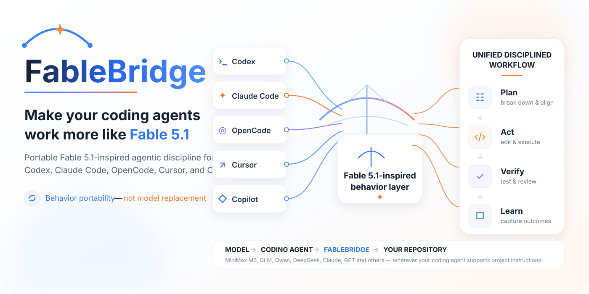

# FableBridge

### Make your coding agents work more like Fable 5.1.

**Portable Fable 5.1-inspired agentic discipline for Codex, Claude Code, OpenCode, Cursor, and GitHub Copilot.**

<p align="center">
  
</p>

> **Behavior portability — not model replacement.** FableBridge transfers useful workflow discipline. It does not turn another model into Fable 5.1 or reproduce capabilities the underlying model does not have.

## 30-second install

Clone or download FableBridge, then run the installer **from the repository where you want the instructions installed**:

```bash
python /path/to/FableBridge/scripts/install.py codex
```

Or choose another supported target:

```bash
python /path/to/FableBridge/scripts/install.py claude-code
python /path/to/FableBridge/scripts/install.py opencode
python /path/to/FableBridge/scripts/install.py cursor
python /path/to/FableBridge/scripts/install.py github-copilot
```

Preview without writing:

```bash
python /path/to/FableBridge/scripts/install.py opencode --dry-run
```

The installer **will not silently overwrite an existing instruction file**. Use `--force` only when you explicitly want replacement.

---

## What is FableBridge?

FableBridge is **not a plugin, model, fine-tune, jailbreak, proxy, or leaked system prompt**.

It is a **portable coding-agent behavior profile**: one canonical set of workflow instructions rendered into the native project-instruction format used by different coding agents.

```text
MODEL
  ↓
CODING AGENT
  ↓
FABLEBRIDGE INSTRUCTION FILE
  ↓
YOUR REPOSITORY
```

That means the underlying model can change while the working discipline stays consistent.

## Can I use Kimi, GLM, Qwen, DeepSeek, or another model?

**Yes — when your coding agent can run that model.**

For example, if you use OpenCode:

```text
Kimi        ─┐
GLM         ├──> OpenCode ──> AGENTS.md ──> Your repo
Qwen        ┤
DeepSeek    ┘
```

FableBridge sits at the **agent instruction layer**, not inside the model.

So a useful setup can be:

```text
Kimi      + OpenCode + FableBridge
GLM       + OpenCode + FableBridge
Qwen      + OpenCode + FableBridge
DeepSeek  + OpenCode + FableBridge
```

You can later swap the model without rewriting the FableBridge behavior profile.

> FableBridge can improve workflow discipline only to the extent that the underlying model and coding agent can follow the instructions and use the required tools.

## Supported agents

| Coding agent | FableBridge adapter | Installed into your repo |
| --- | --- | --- |
| Claude Code | `adapters/claude-code/CLAUDE.md` | `CLAUDE.md` |
| Codex | `adapters/codex/AGENTS.md` | `AGENTS.md` |
| OpenCode | `adapters/opencode/AGENTS.md` | `AGENTS.md` |
| Cursor | `adapters/cursor/fable51.mdc` | `.cursor/rules/fable51.mdc` |
| GitHub Copilot | `adapters/github-copilot/copilot-instructions.md` | `.github/copilot-instructions.md` |

### Don't want to use the installer?

Copy the matching adapter manually to the path above.

If your project already has an instruction file, **merge FableBridge into the existing rules** rather than discarding project-specific instructions.

For an unsupported agent, start with [`FABLE51.md`](FABLE51.md) as the generic profile and place it wherever that agent accepts project or workspace instructions.

---

## What behavior does it transfer?

FableBridge focuses on the parts of Fable 5.1-style agent operation that are meaningfully portable as instructions:

| Behavior | FableBridge default |
| --- | --- |
| Finish implementation instead of stopping after analysis | ✅ |
| Avoid re-asking permission for already-authorized reversible work | ✅ |
| Batch independent tool calls | ✅ |
| Prefer surgical edits over whole-file rewrites | ✅ |
| Avoid unrelated scope creep | ✅ |
| Inspect changes before declaring success | ✅ |
| Run focused tests, then broaden validation when justified | ✅ |
| Keep useful lead-agent work moving while subagents run | ✅ |
| Preserve continuity through long-running tasks | ✅ |
| Give concise progress updates | ✅ |
| Surface blockers instead of silently abandoning work | ✅ |
| Never fabricate tests, benchmarks, citations, or repository state | ✅ |

The canonical behavior contract lives in [`FABLE51.md`](FABLE51.md).

## Why not just use a giant prompt?

Because FableBridge is designed as a **cross-agent portability layer**, not a magic-prompt gimmick.

The project provides:

- one canonical behavior profile;
- native instruction files for multiple coding agents;
- deterministic adapter generation;
- a safe installer;
- overwrite protection;
- tests that keep adapters synchronized;
- explicit sourcing and capability limits.

The goal is repeatable behavior configuration that can live with the repository and be reviewed like code.

---

## Core operating principles

### 1. Finish the requested work

When implementation has been requested, continue to a completed or genuinely blocked state instead of stopping after analysis.

### 2. Keep scope disciplined

Treat the user's request or approved plan as the deliverable. Avoid unrelated cleanup and feature creep.

### 3. Parallelize independent work

Batch independent reads, searches, inspections, and checks when the environment supports it. Keep dependent writes ordered.

### 4. Inspect before editing

Ground changes in the actual repository state and its existing conventions.

### 5. Prefer surgical changes

Make the smallest coherent change that fully solves the task instead of rewriting files unnecessarily.

### 6. Verify before claiming success

Inspect the result, run relevant checks, and clearly distinguish observed results from recommendations.

### 7. Maintain continuity

Preserve important decisions, exact paths, constraints, progress, and blockers across long tasks.

### 8. Report progress concisely

Keep the user oriented without narrating every low-level command.

Read the complete contract in [`FABLE51.md`](FABLE51.md).

---

## Deterministic adapters

The five committed adapters are rendered from the same canonical behavior profile.

Regenerate them:

```bash
python scripts/render.py
```

Verify that committed adapters are synchronized:

```bash
python scripts/render.py --check
```

## Tests

FableBridge V0.1 uses the Python standard library only.

```bash
python -m unittest discover -s tests -v
```

The test suite checks adapter synchronization, installation behavior, overwrite protection, and native destination paths.

GitHub Actions is configured to run adapter consistency checks and the test suite on pushes and pull requests.

---

## Source honesty

FableBridge separates publicly grounded Fable 5.1-style workflow guidance from additional general software-engineering discipline added by this project.

See:

- [`docs/behavior-sources.md`](docs/behavior-sources.md) — source and behavior mapping
- [`docs/fable-5.1-cheatsheet.md`](docs/fable-5.1-cheatsheet.md) — quick behavior reference
- [`docs/launch-kit.md`](docs/launch-kit.md) — launch copy and public-release checklist

There are **no fabricated benchmark numbers** in V0.1.

## What FableBridge cannot transfer

Instruction files cannot transfer:

- model weights or training;
- raw model intelligence;
- context-window size;
- hidden reasoning or private system instructions;
- proprietary infrastructure;
- host-agent tool quality;
- latency, pricing, or safety architecture;
- capabilities the underlying model does not possess.

That limitation is intentional and central to the project's positioning:

> **Transfer workflow behavior and agentic discipline — not model intelligence.**

---

## Repository structure

```text
FableBridge/
├── README.md
├── FABLE51.md
├── adapters/
│   ├── claude-code/
│   ├── codex/
│   ├── opencode/
│   ├── cursor/
│   └── github-copilot/
├── assets/
│   └── fablebridge-hero.svg
├── docs/
├── scripts/
│   ├── install.py
│   └── render.py
├── tests/
└── .github/workflows/ci.yml
```

## Roadmap

V0.1 is intentionally small and launch-focused. Possible future versions can add:

- benchmark and evaluation harnesses;
- composable behavior profiles;
- a behavior compiler;
- automatic agent detection;
- more coding-agent adapters;
- comparative evaluation across models and agents;
- additional frontier-model workflow profiles.

None of those are required to use FableBridge today.

## Contributing

Issues and pull requests are welcome after public launch. See [`CONTRIBUTING.md`](CONTRIBUTING.md).

## License

MIT. See [`LICENSE`](LICENSE).

---

**FableBridge is an independent open-source project and is not affiliated with or endorsed by Anthropic. Product and model names belong to their respective owners.**
